# Signature Chain POC con PostgreSQL e Python

Questa Proof of Concept (POC) dimostra come costruire una **signature chain**: una sequenza immutabile di firme digitali su uno stesso documento. Ogni firma è collegata alla precedente, garantendo **autenticità**, **integrità** e **sequenzialità**.

Questa POC utilizza chiavi RSA generate in memoria e non persistite. In un ambiente reale, si raccomanda l’uso di:

- HSM o key vault
- Timestamp Authority (TSA)
- Certificati validi e verificabili

## ⚙️ Funzionalità principali

- Firme digitali su documenti con RSA
- Catena crittografica con hash SHA-256
- Verifica di integrità della catena
- Database PostgreSQL con vincoli di integrità
- Avvio del database tramite Podman

## 🧱 Architettura

Il sistema si basa su un'applicazione Python che interagisce con un database PostgreSQL per memorizzare e verificare una catena di firme digitali.

```mermaid
graph LR
    subgraph "Applicazione"
        P["🐍 Python Script<br>(main.py)"]
    end
    subgraph "Database (gestito da Podman)"
        DB[(🐘 PostgreSQL)]
        TBL[📄 Tabella: signature_chain]
    end
    USER[👤 Utente/Processo Firmatario] -- Esegue --> P
    P -- Connette e opera su --> DB
    DB -- Contiene --> TBL

    style P fill:#306998,stroke:#333,stroke-width:2px,color:#fff
    style DB fill:#2F6792,stroke:#333,stroke-width:2px,color:#fff
    style TBL fill:#ADD8E6,stroke:#333,stroke-width:2px,color:#000
    style USER fill:#FFD700,stroke:#333,stroke-width:2px,color:#000
```



Ogni firma su un documento viene registrata come un blocco nella tabella `signature_chain`. La struttura di un blocco è la seguente:

- `id` (SERIAL PRIMARY KEY): Identificativo univoco progressivo del blocco.
- `document_id` (UUID): Identificativo univoco del documento a cui si riferisce la catena di firme. Questo permette di avere catene separate per documenti diversi.
- `signer` (VARCHAR(255)): Nome o identificativo del firmatario.
- `document_hash` (VARCHAR(64)): Hash SHA-256 del contenuto del documento originale. Questo hash rimane costante per tutte le firme della stessa catena sullo stesso documento.
- `prev_hash` (VARCHAR(128), NULLABLE): Hash della firma (`signature`) del blocco precedente nella catena. Per il primo blocco (blocco genesi), questo valore è `NULL`.
- `chain_hash` (TEXT, GENERATED ALWAYS AS STORED): **Colonna Calcolata Automaticamente.** Questa colonna contiene l'hash SHA-256 della concatenazione di `prev_hash` (o una stringa vuota se `prev_hash` è `NULL`) e `document_hash` del blocco corrente. In pratica, rappresenta l'hash dei dati che vengono effettivamente firmati digitalmente per produrre il campo `signature`. Viene calcolata e memorizzata automaticamente dal database (`encode(digest(coalesce(prev_hash, '') || document_hash, 'sha256'), 'hex')`). Sebbene non sia utilizzata attivamente dallo script Python per la logica di costruzione o verifica della catena (che ricalcola questi dati in memoria), può essere utile per query dirette al database, per debug, o per meccanismi di verifica alternativi a livello di database.
- `signature` (VARCHAR(128)): Firma digitale RSA. Viene calcolata firmando la concatenazione di `prev_hash` (o una stringa vuota se `NULL`) e `document_hash` del blocco corrente (ovvero, firmando i dati il cui hash è rappresentato da `chain_hash`). Questo campo rappresenta l'hash crittografico del blocco corrente e viene usato come `prev_hash` dal blocco successivo.
- `created_at` (TIMESTAMP DEFAULT CURRENT_TIMESTAMP): Timestamp di creazione del blocco.

### Esempio di Record nella Tabella

Ecco un esempio di come potrebbero apparire i record nella tabella `signature_chain`:

#### Blocco 1 (Genesi - Firmatario: Antonio)

| Campo           | Valore                                                                 | Descrizione                                                                 |
|-----------------|------------------------------------------------------------------------|-----------------------------------------------------------------------------|
| `id`            | `1`                                                                    | Identificativo progressivo                                                  |
| `document_id`   | `c4a7a134-8a02-4bad-bc9f-395f7f0f1a33`                                  | UUID del documento                                                          |
| `signer`        | `Antonio`                                                              | Nome del firmatario                                                         |
| `document_hash` | `f2ca1bb6c7e907d06dafe4687e579fce76b37e4e93b7605022da52e6ccc26fd2`      | Hash SHA-256 del documento originale                                        |
| `prev_hash`     | `NULL`                                                                 | Essendo il primo blocco, non ha un hash precedente                          |
| `signature`     | `a3f5b1...c72e`                                                        | Firma RSA dei dati `'' + document_hash` (hash esadecimale di 128 caratteri) |
| `created_at`    | `2025-05-21 14:30:00.123456+00`                                         | Timestamp di creazione                                                      |

#### Blocco 2 (Firmatario: Marianna)

| Campo           | Valore                                                                 | Descrizione                                                                      |
|-----------------|------------------------------------------------------------------------|----------------------------------------------------------------------------------|
| `id`            | `2`                                                                    | Identificativo progressivo                                                       |
| `document_id`   | `c4a7a134-8a02-4bad-bc9f-395f7f0f1a33`                                  | Stesso `document_id` del blocco precedente                                       |
| `signer`        | `Marianna`                                                             | Nome del firmatario                                                              |
| `document_hash` | `f2ca1bb6c7e907d06dafe4687e579fce76b37e4e93b7605022da52e6ccc26fd2`      | Stesso `document_hash` del blocco precedente                                     |
| `prev_hash`     | `a3f5b1...c72e`                                                        | La `signature` del blocco precedente (quello di Antonio)                         |
| `signature`     | `b8e0d9...f4a1`                                                        | Firma RSA dei dati `prev_hash + document_hash` (hash esadecimale di 128 caratteri) |
| `created_at`    | `2025-05-21 14:35:00.654321+00`                                         | Timestamp di creazione                                                           |

### Schema della Catena di Firme

Il diagramma seguente illustra come i blocchi sono concatenati:


### 🛡️ Verifica dell'Integrità del Documento Originale (Esterna alla Catena)

Mentre la `signature_chain` garantisce l'integrità e la sequenzialità delle firme apposte su un documento con un determinato `document_hash`, è cruciale considerare anche l'integrità del documento originale archiviato esternamente (ad esempio, su un sistema di Document Management System come Documentum, identificato tramite `document_id`).

Il `document_hash` memorizzato nella catena rappresenta l'impronta digitale del documento al momento in cui la catena di firme è stata iniziata. Per una verifica completa e robusta, il processo dovrebbe includere i seguenti passaggi aggiuntivi, esterni alla logica intrinseca della catena di firme:

1.  **Recupero del Documento Attuale**: Utilizzando il `document_id` presente nella `signature_chain`, recuperare la versione corrente del documento dal suo sistema di archiviazione primario.
2.  **Calcolo dell'Hash Attuale**: Calcolare l'hash SHA-256 del documento recuperato al punto precedente.
3.  **Confronto Fondamentale**: Confrontare questo hash appena calcolato con il `document_hash` memorizzato nel primo blocco (o in qualsiasi blocco, dato che dovrebbe essere identico per tutti i blocchi relativi allo stesso `document_id`) della `signature_chain`.

**Se i due hash (quello calcolato dal documento attuale e quello memorizzato nella catena) non corrispondono, ciò indica inequivocabilmente che il documento originale è stato alterato o sostituito nel sistema di archiviazione dopo l'inizio del processo di firma.**

Questo controllo è essenziale perché:

- La catena di firme, di per sé, valida solo che le approvazioni sono state date in sequenza su un documento che *aveva* un certo contenuto (identificato dal `document_hash` originale).
- Non può, da sola, impedire o rilevare modifiche al file sorgente nel suo repository esterno.

L'attuale script `main.py` si concentra sulla validazione dell'integrità interna della catena crittografica. L'implementazione della verifica del documento originale richiederebbe un'integrazione con il sistema di gestione documentale per recuperare il file basandosi sul `document_id`.

### ✅ Caratteristiche Chiave della Catena

- **Immutabilità**: Una volta che un blocco è aggiunto, la sua `signature` dipende dal contenuto e dal blocco precedente. Modificare un blocco precedente invaliderebbe l'intera catena successiva.
- **Integrità del Documento**: `document_hash` assicura che tutte le firme si riferiscano alla stessa versione del documento.
- **Sequenzialità Verificabile**: `prev_hash` crea un legame cronologico tra le firme.
- **Autenticità del Firmatario**: Ogni `signature` è creata con la chiave privata del firmatario e può essere verificata con la sua chiave pubblica.

## 🚀 Come avviare la POC

### 1. Requisiti

- [Podman](https://podman.io/) (o Docker, con lievi modifiche ai comandi `podman-compose`)
- Python 3.9+
- Librerie Python: `psycopg2-binary`, `cryptography` (assicurati che `psycopg2-binary` sia usato per facilità di installazione locale invece di `psycopg2` che potrebbe richiedere dipendenze di compilazione).

Installa le dipendenze Python:

```bash
pip install -r requirements.txt
```

(Assicurati che `requirements.txt` contenga `psycopg2-binary` e `cryptography`)

### 2. Configurazione Variabili d'Ambiente (Opzionale)

Lo script `main.py` può essere configurato tramite variabili d'ambiente per i dettagli di connessione al database. Se non impostate, verranno usati valori di default.

Esempio:

```bash
export APP_DB_USER="mio_user_app"
export APP_DB_PASSWORD="mia_password_app"
export SUPER_DB_USER="postgres_admin"
export SUPER_DB_PASSWORD="admin_password"
export DB_NAME="poc_signatures"
export DB_HOST="localhost"
```

I valori di default sono: `app_user`, `app_password`, `postgres`, `postgres`, `signature_demo`, `localhost`.

### 3. Avvio del database PostgreSQL

Viene fornito un file `podman-compose.yml` per avviare un'istanza di PostgreSQL con gli utenti e il database necessari preconfigurati.

```bash
podman-compose -f podman-compose.yml up -d
```

Questo comando:

- Avvia un container PostgreSQL.
- Crea il database specificato (default: `signature_demo`).
- Crea gli utenti `app_user` (con permessi limitati) e `postgres` (superutente).
- Esegue lo script `init.sql` per creare la tabella `signature_chain` e impostare i permessi e la Row-Level Security (RLS) per `app_user`.
- Espone la porta `5432` del database sull'host.

### 4. Esegui lo script di firma e verifica

Lo script `main.py` simula i seguenti scenari:

1. **Scenario Utente Applicativo (`app_user`)**:
    - Connessione al DB come `app_user`.
    - Inserimento di una sequenza di firme da parte di diversi firmatari (Antonio, Marianna, Claudio) sullo stesso documento.
    - Verifica dell'integrità della catena.
    - Tentativo (fallito, grazie a RLS e GRANT) di manomettere un record esistente da parte di `app_user`.
    - Nuova verifica della catena.
2. **Scenario Utente Privilegiato (`super_db_user`, default: `postgres`)**:
    - Pulizia della tabella.
    - Connessione al DB come utente con privilegi elevati.
    - Reinserimento della sequenza di firme.
    - Verifica dell'integrità della catena.
    - Tentativo (riuscito) di manomettere un record esistente da parte del superutente.
    - Nuova verifica della catena, che **dovrebbe fallire**, evidenziando la manomissione.

```bash
python main.py
```

### 5. Verifica della Catena

La funzione `verify_chain` nello script:


1. Recupera tutti i record dalla tabella `signature_chain` in ordine di ID.
2. Per ogni record:
    a. Controlla che `prev_hash` corrisponda alla `signature` del record precedente (a meno che non sia il blocco genesi, dove `prev_hash` deve essere `NULL`).
    b. Ricostruisce i dati che sono stati originariamente firmati: `(prev_hash || document_hash)`.
    c. Verifica la `signature` del record corrente usando i dati ricostruiti e la chiave pubblica del `signer` associato a quel record.
3. Se una qualsiasi di queste verifiche fallisce, l'intera catena è considerata compromessa.

### Output Atteso (Estratto)

L'output sarà colorato e includerà emoji per indicare lo stato delle operazioni. Un esempio parziale:

```text
💾 Tentativo di pulire la tabella signature_chain come utente 'postgres'...
✅ Tabella signature_chain pulita con successo.

===== SCENARIO 1: Utente Applicativo (app_user) =====
💾 Tentativo di connessione al database 'signature_demo' come utente 'app_user'...
✅ Connessione come app_user riuscita.

🔗==== Sequenza Firme Inserite nella Catena ====
ℹ️ Documento Originale: "Contenuto documento firmato da più persone"
ℹ️ Hash Documento Originale: <hash_del_documento>
----------------------------------------------------------------------
🧱 ID Blocco: 1
  Firmatario: Antonio
  Hash Documento Firmato: <hash_del_documento>
  Hash Catena Precedente: N/A (Blocco Genesi)
  Hash Catena Corrente (Firma del Blocco): <signature_blocco_1>...
----------------------------------------------------------------------
🧱 ID Blocco: 2
  Firmatario: Marianna
  Hash Documento Firmato: <hash_del_documento>
  Hash Catena Precedente: <signature_blocco_1>
  Hash Catena Corrente (Firma del Blocco): <signature_blocco_2>...
----------------------------------------------------------------------
... (altre firme e output di verifica) ...

🔗==== Verifica Integrità Catena Firme (Contesto: app_user - Post Inserimento) ====
...
✅ La catena delle firme è VALIDA. Integrità CONFERMATA. ✅
----------------------------------------------------------------------

⚠️---- 1.2 Tentativo di Manomissione UPDATE (come app_user) ----
ℹ️ Tentativo di UPDATE del document_hash del blocco ID: 2 (Firmatario: Marianna) come 'app_user'.
✅ SUCCESSO: Tentativo di UPDATE BLOCCATO dal DB per 'app_user' come previsto!
  ℹ️ Errore DB (SQLSTATE 42501): permission denied for table signature_chain
... (output scenario superuser con manomissione e fallimento verifica crittografica) ...

🏁Fine della dimostrazione.
```

## 📚 Appendice: Considerazioni sugli Algoritmi Crittografici

In questa Proof of Concept (PoC), sono stati utilizzati i seguenti algoritmi crittografici:

- **Algoritmo di Hash:** SHA-256
- **Algoritmo di Firma Digitale:** RSA con chiavi a 2048 bit (padding PKCS1v15)

Queste scelte rappresentano una base solida e ampiamente compatibile per molte applicazioni. Tuttavia, a seconda dei requisiti specifici di sicurezza, prestazioni e longevità del sistema, è possibile e spesso consigliabile considerare algoritmi più robusti o differenti.

### Alternative per l'Hashing

- **SHA-512:** Parte della famiglia SHA-2, produce un hash di 512 bit, offrendo una maggiore resistenza teorica alle collisioni rispetto a SHA-256. Può essere più performante su architetture a 64 bit.
- **SHA-3 (es. SHA3-256, SHA3-512):** Uno standard più recente con un design interno diverso da SHA-2, considerato molto sicuro.
- **BLAKE2/BLAKE3:** Algoritmi moderni noti per l'alta velocità e sicurezza. BLAKE3 è particolarmente efficiente e parallelizzabile.

### Alternative per la Firma Digitale

- **RSA con chiavi più lunghe (es. 3072 o 4096 bit):** Aumentare la lunghezza della chiave RSA ne incrementa la robustezza contro attacchi computazionali. RSA 2048 bit è generalmente sicuro, ma per requisiti di sicurezza più elevati o per una protezione a più lungo termine, chiavi più lunghe sono preferibili. Questo comporta un aumento del carico computazionale.
- **Elliptic Curve Cryptography (ECC):**
  - **ECDSA (Elliptic Curve Digital Signature Algorithm):** Offre un livello di sicurezza paragonabile a RSA ma con chiavi significativamente più corte (es. una chiave ECC a 256 bit equivale circa a una RSA a 3072 bit). Questo si traduce in chiavi più piccole e operazioni di firma/verifica potenzialmente più veloci. Curve comuni includono `P-256` (NIST), `P-384`, `P-521`.
  - **EdDSA (Edwards-curve Digital Signature Algorithm, es. Ed25519):** Un altro schema di firma basato su curve ellittiche, apprezzato per la sua sicurezza e per essere meno suscettibile a errori di implementazione rispetto a ECDSA.

### Fattori da Considerare per la Scelta

1. **Livello di Sicurezza Richiesto:** Valutare la sensibilità dei dati e il periodo per cui la sicurezza deve essere garantita.
2. **Prestazioni:** Algoritmi più complessi o con chiavi più lunghe possono avere un impatto sulle prestazioni. ECC/EdDSA spesso offrono un buon bilanciamento.
3. **Compatibilità e Standard:** Considerare gli standard di settore, le normative applicabili e la compatibilità con altri sistemi.
4. **Supporto delle Librerie:** Verificare che le librerie crittografiche utilizzate (come `cryptography` in Python) supportino pienamente gli algoritmi scelti.
5. **Resistenza Quantistica:** È importante notare che gli algoritmi classici come RSA, ECC, SHA-2 e SHA-3 non sono considerati resistenti ad attacchi da parte di computer quantistici su larga scala. La crittografia post-quantistica (PQC) è un campo di ricerca attivo per affrontare questa futura minaccia. Per sistemi che richiedono una sicurezza a lunghissimo termine, monitorare gli sviluppi in PQC è fondamentale.

La scelta degli algoritmi crittografici è una decisione critica che dovrebbe essere basata su un'attenta analisi dei rischi e dei requisiti specifici del progetto.
