## Cronologia delle revisioni

| Versione | Data       | Autore          | Descrizione delle Modifiche                |
| :------- | :--------- | :-------------- | :----------------------------------------- |
| 1.0.0    | 2025-05-17 | Antonio Musarra | Primo stesura                              |
| 1.1.0    | 2025-05-24 | Antonio Musarra | Aggiunto il capitolo Appendice             |
| 1.1.1    | 2025-05-25 | Antonio Musarra | Correzioni di typo error e semplificazione |
| 1.1.2    | 2025-05-25 | Antonio Musarra | Revisione capitolo Riferimenti utili       |

[TOC]

<div style="page-break-after: always; break-after: page;"></div>

Nel contesto dell'attuale panorama digitale, la salvaguardia dell'integrità e dell'autenticità documentale costituisce una problematica di primaria importanza. La necessità di assicurare che un documento non sia stato oggetto di alterazioni e che le sottoscrizioni apposte siano verificate e sequenzialmente ordinate è un requisito imprescindibile per una molteplicità di processi giuridici, finanziari e amministrativi. Tentativi di manipolazione di clausole contrattuali post-sottoscrizione o l'inserimento fraudolento di firme clandestine rappresentano rischi intrinseci.

L'obiettivo dell'articolo si propone di illustrare la **Signature Chain** come soluzione per la sicurezza dei documenti digitali, garantendo l'inalterabilità perpetua delle firme, l'integrità del contenuto e la rigorosa sequenzialità delle apposizioni. Tale metodologia conferisce un elevato grado di affidabilità, assicurando l'inviolabilità del documento e l'immodificabilità della sua cronistoria. Per una comprensione pratica, l'articolo include anche un esempio dimostrativo tramite una **Proof of Concept (PoC)**.

## Concetto fondamentale della Signature Chain

La Signature Chain è definibile come una concatenazione crittograficamente vincolata di firme digitali apposte su un documento. La sua struttura è assimilabile a una catena fisica, **ove ciascun anello**, rappresentato da una firma digitale, **è saldato in maniera indissolubile al suo predecessore**. L'impossibilità di disconnettere o interporre elementi intermedi costituisce un principio cardine.

Ogni sottoscrizione è intrinsecamente legata alla precedente, costituendo una catena crittografica che assicura l'autenticità, l'integrità del dato e la sequenzialità delle apposizioni. Essa opera come un sigillo digitale che attesta: "La presente sottoscrizione è stata apposta da un determinato soggetto, successivamente a un'altra sottoscrizione, e il documento possedeva *esattamente* il seguente contenuto in quel preciso istante." Si tratta, in sostanza, di una **"cronistoria documentale"** che non può essere retroattivamente alterata, configurandosi come un registro immutabile di tutte le firme e del contenuto su cui esse sono state apposte. La fiducia conferita da tale meccanismo è di notevole entità.

A scopo dimostrativo, ho realizzato una Proof of Concept (PoC), disponibile su GitHub (<https://github.com/amusarra/signature-chain-poc>), usando PostgreSQL e Python che mostra il funzionamento del meccanismo. Le chiavi RSA, generate in memoria, sono state impiegate esclusivamente per la dimostrazione. Tuttavia, per applicazioni in contesti critici, quali il settore bancario o le transazioni legali vincolanti, si renderebbe indispensabile l'adozione di soluzioni di sicurezza avanzate. Tra queste, si annoverano gli [Hardware Security Modules (HSM)](https://en.wikipedia.org/wiki/Hardware_security_module) o i key vault (sistemi di custodia certificati per chiavi crittografiche), una [Timestamp Authority (TSA)](https://goodsign.io/term/Timestamp-Authority-TSA) per la certificazione temporale esatta (assicurando l'esatta data e ora di ogni sottoscrizione, fino al millisecondo, eliminando contestazioni temporali), e certificati digitali qualificati, rilasciati da enti certificatori riconosciuti. Pertanto, si sottolinea la natura non sperimentale ma robusta e legalmente valida di tale sistema per applicazioni reali.

<div style="page-break-after: always; break-after: page;"></div>

## Architettura e funzionamento

Il sistema di Signature Chain, implementato dalla PoC, si basa su un’applicazione realizzata in Python che interagisce con un database per la memorizzazione e la verifica delle firme. Tale interazione è assimilabile all'operato di un segretario altamente preciso e incorruttibile, il quale registra ogni singola sottoscrizione con meticolosità, senza omissioni o possibilità di corruzione.

Ogni qualvolta una firma viene apposta su un documento, un nuovo **"blocco"** viene aggiunto a una tabella specifica del database, designata come `signature_chain`. Questo blocco incapsula tutti i dettagli della firma in questione ed è crittograficamente collegato al blocco precedente. Si configura come un'appendice auto-verificante del documento principale.

Il diagramma a seguire illustra l’architettura del sistema implementata da questa PoC, dov'è delineato il flusso logico delle informazioni.

```mermaid
graph LR
    subgraph "Applicazione"
        P["🐍 Python Script<br>(main.py)"]
    end
    subgraph "Database (gestito da Podman)"
        DB[(🐘 PostgreSQL)]
        TBL[📄 Tabella: signature_chain]
    end
    USER[👤 Utente/Processo Firmatario] -- Esegue --> P
    P -- Connette e opera su --> DB
    DB -- Contiene --> TBL

    style P fill:#306998,stroke:#333,stroke-width:2px,color:#fff
    style DB fill:#2F6792,stroke:#333,stroke-width:2px,color:#fff
    style TBL fill:#ADD8E6,stroke:#333,stroke-width:2px,color:#000
    style USER fill:#FFD700,stroke:#333,stroke-width:2px,color:#000
```



**Figura 1**: Architettura del sistema di Signature Chain

Il flusso mostrato dal precedente diagramma, è logico e trasparente: un'entità (sia essa un utente o un processo automatizzato) interagisce con l'applicazione Python, la quale stabilisce una connessione con il database PostgreSQL per gestire la tabella delle firme. Questa tabella rappresenta il fulcro del sistema, ove ogni segmento della cronistoria documentale viene registrato.

La struttura di ciascun blocco è concepita per garantire un'elevata sicurezza e tracciabilità; ogni singolo elemento è inserito con una finalità precisa e contribuisce all'integrità complessiva della catena. Tale configurazione è paragonabile a una carta d'identità estremamente dettagliata per ogni singola firma:

* **id** (SERIAL PRIMARY KEY): questo campo rappresenta un identificativo numerico univoco, incrementale e generato automaticamente per ogni blocco aggiunto. La sua funzione primaria è l'identificazione univoca del blocco all'interno del database, facilitandone la ricerca e l'ordinamento sequenziale.  
* **document_id** (UUID): costituisce un codice identificativo universale univoco (UUID) per il documento. Questo identificativo è essenziale poiché vincola tutte le firme alla catena corretta, permettendo la gestione di catene distinte per documenti diversi, prevenendo confusioni o interscambi di firme tra file. Per ogni documento distinto, un `document_id` univoco è assegnato, garantendo l'unicità di ciascuna catena.  
* **signer** (VARCHAR(255)): questo campo indica in modo esplicito l'identità del soggetto che ha apposto la firma su quel blocco specifico. Può contenere un nome, un identificativo utente o un riferimento a un certificato digitale. La sua funzione è di attestare la responsabilità della firma.  
* **document_hash** (VARCHAR(64)): rappresenta l'impronta digitale crittografica del documento originale, calcolata mediante l'algoritmo SHA-256. Si tratta di una stringa alfanumerica di lunghezza fissa (64 caratteri esadecimali) che subisce una *completa* alterazione anche a fronte della minima modifica (un singolo pixel, una virgola, uno spazio) nel contenuto del documento. Questo hash non muta per il medesimo documento, fungendo da garanzia che la versione sottoscritta sia esattamente quella specificata, e non una versione modificata. È il "DNA" crittografico del documento in un dato istante, una forma di "checksum" crittografico inalterabile.  
* **prev_hash** (VARCHAR(128), NULLABLE): questo campo contiene l'hash della firma (la signature) del blocco immediatamente precedente nella catena. Costituisce il "legame" crittografico che connette il blocco corrente al suo predecessore. Qualora si tratti del primo blocco della catena (il "blocco genesi", punto di origine), questo campo è NULL, indicando l'assenza di un predecessore. Questo campo è cruciale per la creazione della sequenzialità e dell'immutabilità: ogni blocco "punta" crittograficamente al precedente.  
* **chain_hash** (TEXT, GENERATED ALWAYS AS STORED): colonna **calcolata automaticamente**. Questa colonna contiene un hash SHA-256 risultante dalla concatenazione del `prev_hash` (o una stringa vuota per il blocco genesi) e del `document_hash` del blocco corrente. Essa rappresenta l'hash dei dati che sono stati effettivamente sottoposti a firma digitale, prima dell'applicazione della firma stessa. Il database provvede autonomamente al calcolo e alla memorizzazione di questo valore, eliminando possibilità di errore o manipolazione. La sua presenza è una garanzia aggiuntiva che i dati su cui si basa la firma sono corretti e non sono stati alterati. Sebbene lo script Python in questa PoC non utilizzi attivamente questo campo per la logica di costruzione o verifica della catena (poiché i valori vengono ricalcolati dinamicamente per la massima sicurezza), la sua inclusione nel database può rivelarsi estremamente utile per query dirette, per controlli supplementari di integrità a livello di database, o per attività di debugging e audit esterni. Rappresenta un ulteriore livello di garanzia e trasparenza.  
* **signature** (VARCHAR(128)): questo campo contiene la firma digitale RSA effettiva. Non si tratta di un semplice hash, bensì del risultato di un complesso processo crittografico che impiega la chiave privata del firmatario. La firma viene generata applicando l'algoritmo di firma alla concatenazione del `prev_hash` e del `document_hash` del blocco corrente. Questa signature funge da hash crittografico del blocco corrente, rappresentandone l'impronta unica e verificabile. Un aspetto fondamentale è che il valore di questa signature diviene il `prev_hash` per il blocco successivo, perpetuando così la catena in maniera indefinita (o fino alla cessazione delle sottoscrizioni). Questo meccanismo salda un blocco all'altro, conferendo alla catena la sua inalterabilità. Qualsiasi alterazione della firma invaliderebbe il blocco successivo.  
* **created_at** (TIMESTAMP DEFAULT CURRENT_TIMESTAMP): questo campo registra il timestamp esatto di creazione del blocco, fino al millisecondo. La sua importanza è cruciale per la tracciabilità, per l'accertamento dell'ordine cronologico delle firme e per fornire una prova temporale in caso di controversie legali o audit. L'impossibilità di retrodatare o postdatare le firme è garantita da questo marcatore temporale.

<div style="page-break-after: always; break-after: page;"></div>

### Esemplificazione dei Record nella Tabella

Di seguito è presentata un'illustrazione dei record all'interno della tabella `signature_chain`, con esempi concreti che dimostrano la correlazione tra i campi e la formazione della catena:

#### Blocco 1 (Genesi - Firmatario: Antonio)

Questo blocco rappresenta l'elemento iniziale, la "genesi" della catena di firme per un documento specifico. Costituisce il punto di partenza, privo di un predecessore a cui collegarsi. Si può immaginare *Antonio* come il primo soggetto a sottoscrivere un nuovo contratto.

| Campo | Valore | Descrizione |
| :---- | :---- | :---- |
| id | 1 | L'identificativo del blocco, il primo in questa catena. Un semplice contatore, ma essenziale per l'ordinamento. |
| document\_id | c4a7a134-8a02-4bad-bc9f-395f7f0f1a33 | L'identificativo universale univoco del documento oggetto di firma. Questo UUID (Universally Unique Identifier) assicura la distinzione di questo documento da qualsiasi altro nel sistema. |
| signer | Antonio | L'identità del primo firmatario, chiaramente registrata. |
| document\_hash | f2ca1bb6c7e907d06dafe4687e579fce76b37e4e93b7605022da52e6ccc26fd2 | L'hash SHA-256 del documento originale. Questo valore rappresenta il "DNA" crittografico del documento, una stringa di 64 caratteri esadecimali che lo identifica in modo univoco. Qualsiasi modifica al documento comporterebbe un hash differente. |
| prev\_hash | NULL | Poiché si tratta del primo blocco, non esiste alcuna firma precedente a cui collegarsi, pertanto il valore è nullo. Ciò segnala l'inizio della catena. |
| signature | a3f5b1...c72e | La firma digitale di Antonio, calcolata sulla concatenazione di una stringa vuota (per il `prev_hash` nullo) e l'hash del documento. Si tratta di una stringa esadecimale di 128 caratteri, risultato della sua sottoscrizione crittografica. |
| created\_at | 2025-05-21 14:30:00.123456+00 | La data e l'ora precise di apposizione della firma da parte di Antonio, inclusi i microsecondi e il fuso orario UTC. Questo timestamp è cruciale per la cronologia. |

**Tabella 1**: Esempio di Blocco 1 (Genesi)

<div style="page-break-after: always; break-after: page;"></div>

#### Blocco 2 (Firmatario: Marianna)

Questo blocco segue il primo e si lega ad esso, incorporando la firma di *Marianna*. Rappresenta un blocco intermedio nella catena, dimostrando la sequenzialità delle sottoscrizioni. Marianna appone la sua firma *dopo* Antonio.

| Campo | Valore | Descrizione |
| :---- | :---- | :---- |
| id | 2 | L'identificativo del blocco, il secondo in questa catena. |
| document\_id | c4a7a134-8a02-4bad-bc9f-395f7f0f1a33 | L'identificativo del documento rimane invariato, poiché la firma si riferisce al medesimo file. Questo è fondamentale per raggruppare tutte le firme relative a un unico documento. |
| signer | Marianna | L'identità del firmatario di questo blocco. |
| document\_hash | f2ca1bb6c7e907d06dafe4687e579fce76b37e4e93b7605022da52e6ccc26fd2 | L'hash del documento rimane lo stesso, a riprova che il documento non ha subito modifiche tra la firma di Antonio e quella di Marianna. Una discrepanza in questo hash invaliderebbe la catena. |
| prev\_hash | a3f5b1...c72e | Questo valore corrisponde alla signature di Antonio dal Blocco 1\. Costituisce il legame crittografico al blocco precedente, garantendo la sequenzialità. Questo è l'elemento chiave della concatenazione. |
| signature | b8e0d9...f4a1 | La firma digitale di Marianna, calcolata sulla concatenazione della signature di Antonio (come `prev_hash`) e l'hash del documento. Questa firma è unica per questo blocco e per questa specifica sequenza. |
| created\_at | 2025-05-21 14:35:00.654321+00 | La data e l'ora precise di apposizione della firma da parte di Marianna. Si noti che è successiva a quella di Antonio, confermando l'ordine cronologico. |

**Tabella 2**: Esempio di Blocco 2

### Schema della catena di firme

Il diagramma seguente illustra come i blocchi sono concatenati. Questo schema garantisce che ogni blocco sia inscindibilmente legato al precedente, formando una catena di integrità e sequenzialità.


**Figura 2**: Schema della Signature Chain

La freccia tratteggiata denota che la **Signature** di un blocco diviene il `prev_hash` del blocco successivo. È questa interdipendenza crittografica che conferisce alla catena la sua robustezza. Qualsiasi tentativo di alterazione di un blocco precedente, sia esso una minima modifica nell'hash del documento o nella firma, comporterebbe una discrepanza negli hash dei blocchi successivi, rendendo la catena **"rotta"** e, di conseguenza, invalida.

### Caratteristiche distintive della catena

Le proprietà intrinseche che conferiscono alla Signature Chain il suo valore e la sua utilità sono assimilabili a capacità distintive. Tali attributi la rendono uno strumento robusto per la sicurezza digitale e la differenziano significativamente da una mera firma elettronica:

* **Immutabilità**: una volta che un blocco è stato aggiunto alla catena, esso diviene inalterabile. La sua natura è paragonabile a quella di un'incisione su pietra digitale, impossibile da modificare in alcun modo. Qualsiasi tentativo di alterazione, anche di un singolo bit, comporterebbe l'invalidazione di tutte le firme successive nella catena. Il sistema è concepito per rilevare immediatamente qualsiasi tentativo di frode, emettendo un segnale di "Manomissione!".  
* **Integrità del documento**: il `document_hash` assicura che tutte le firme presenti nella catena si riferiscano univocamente alla medesima versione del documento. Non vi è possibilità di versioni differenti o di modifiche occulte che possano compromettere la validità delle firme. La garanzia è che il contenuto sottoscritto è esattamente quello, senza ambiguità o interpretazioni errate.  
* **Sequenzialità verificabile**: il `prev_hash` stabilisce un legame cronologico inconfutabile tra le firme. Ciò consente di accertare l'ordine esatto di apposizione delle firme, eliminando dubbi o contestazioni. Si genera una traccia di audit chiara e cristallina, essenziale per processi che richiedono una rigorosa cronologia, come contratti con molteplici firmatari o workflow di approvazione complessi.  
* **Autenticità del firmatario**: ogni signature è generata utilizzando la chiave privata del firmatario, la quale è unica e segreta per tale individuo. Questo meccanismo consente la verifica dell'autenticità della firma tramite la chiave pubblica corrispondente, che è invece di dominio pubblico e può essere liberamente condivisa. L'identità del firmatario è crittograficamente garantita, escludendo l'impersonificazione.

<div style="page-break-after: always; break-after: page;"></div>

## Meccanismi di sicurezza in PostgreSQL per la Signature Chain

PostgreSQL, in quanto sistema di gestione di database relazionali ([RDBMS](https://en.wikipedia.org/wiki/Relational_database)) robusto e di comprovata affidabilità (ampiamente adottato in contesti aziendali critici proprio per la sua affidabilità intrinseca), offre una pluralità di meccanismi di sicurezza fondamentali per l'implementazione e il mantenimento dell'integrità e dell'immutabilità dei dati all'interno di una Signature Chain. Lo script `init.sql` (file di inizializzazione del database) illustra l'applicazione di alcuni di questi principi chiave, i quali costituiscono il fondamento per la costruzione di un sistema sicuro.

### 1. Principio del privilegio minimo (Least Privilege Principle)

Questo principio di sicurezza fondamentale è una direttiva imprescindibile in qualsiasi architettura di sistema: **"Concedere a ogni entità solo i privilegi strettamente necessari per l'adempimento delle proprie funzioni"**. Esso prescrive che a un utente o a un'applicazione debbano essere attribuiti esclusivamente i privilegi minimi indispensabili per l'esecuzione delle proprie operazioni. Tale approccio è analogo alla concessione di chiavi di accesso unicamente alle aree pertinenti, anziché all'intera struttura. Nello script `init.sql`, questo principio è implementato con meticolosità e precisione attraverso:

* **Creazione di un utente applicativo dedicato:**

  ```sql
  CREATE ROLE app_user WITH LOGIN PASSWORD 'app_password';
  ```

  Viene istituito un ruolo specifico (`app_user`) destinato esclusivamente all'applicazione Python. Questo utente è mantenuto rigorosamente separato dall'utente amministratore del database (es. postgres), il quale detiene privilegi omnicomprensivi. Tale segregazione riduce significativamente il rischio in caso di compromissione: qualora un attore malevolo riuscisse a violare l'applicazione, l'accesso al database sarebbe limitato ai soli permessi concessi all'utente applicativo, non estendendosi all'intera base di dati.

* **Concessione di privilegi limitati:**  
  
  ```sql
  GRANT CONNECT ON DATABASE signature_demo TO app_user;
  ```
  
  Consente all'applicazione di stabilire una connessione al database signature\_demo.
  
  ```sql
  GRANT USAGE ON SCHEMA public TO app_user;
  ```
  
  Permette all'applicazione di utilizzare lo schema public, ove risiede la tabella signature\_chain. 
  
  ```sql
  GRANT SELECT, INSERT ON signature_chain TO app_user; 
  ```
  
  Conferisce all'applicazione i permessi di lettura (SELECT) e di inserimento (INSERT) di nuovi dati nella tabella `signature_chain`. 
  
  ```sql
  GRANT USAGE ON SEQUENCE signature_chain_id_seq TO app_user;
  ```
  
  Autorizza l'applicazione all'utilizzo della sequenza preposta alla generazione degli identificativi automatici per i blocchi.

  
  
  Al ruolo `app_user` sono attribuiti unicamente i permessi essenziali: la capacità di connettersi al database, di operare sullo schema pubblico, e, specificamente, i permessi di SELECT (lettura) e INSERT (aggiunta) di nuovi record nella tabella `signature_chain`, oltre all'autorizzazione all'uso della sequenza ID.
  
  È di fondamentale importanza notare l'assenza totale di permessi di UPDATE (modifica) o DELETE (cancellazione). Questa restrizione è cruciale per l'immutabilità della catena: una volta che un blocco è stato inserito, l'applicazione non è in grado di modificarlo o rimuoverlo. Tale dato è, pertanto, blindato e inalterabile.

### 2. Sicurezza a livello di riga (Row Level Security - RLS)

La [RLS](https://www.postgresql.org/docs/current/ddl-rowsecurity.html) in PostgreSQL è una funzionalità di sicurezza avanzata e di notevole potenza che consente la definizione di policy granulari. Tali policy controllano quali righe (ovvero, quali record o "blocchi" della catena) possono essere visualizzate o modificate da specifici utenti o ruoli, anche qualora questi utenti detengano permessi più ampi a livello di tabella. Questo meccanismo agisce come un filtro selettivo all'ingresso di ogni riga del database, determinando l'accesso o la manipolazione dei dati. La RLS introduce un ulteriore strato di controllo granulare, incrementando significativamente la sicurezza del sistema e prevenendo accessi o modifiche non autorizzate anche da parte di utenti con permessi tabellari più ampi. Nello script `init.sql`, la RLS è configurata come segue:

* **Abilitazione e forzatura di RLS**:  
  
  ```sql
  ALTER TABLE signature_chain ENABLE ROW LEVEL SECURITY; 
  ```
  
  Questo comando abilita la funzionalità RLS per la tabella signature\_chain.
  
  ```sql
  ALTER TABLE signature_chain FORCE ROW LEVEL SECURITY;
  ```
  
  Questo comando impone l'applicazione delle policy RLS anche per il proprietario della tabella, impedendo che utenti con privilegi elevati possano aggirarle, a meno di interventi diretti dell'utente postgres stesso, come verrà dimostrato nella PoC.  
  Questi comandi attivano la RLS per la tabella `signature_chain` e ne garantiscono l'applicazione rigorosa, senza eccezioni. Costituiscono un meccanismo di difesa in profondità.  
* **Definizione delle policy di immutabilità:**
  
    ```sql
    CREATE POLICY allow_inserts_for_public ON signature_chain FOR INSERT TO PUBLIC WITH CHECK (true);
    ```

    Questa policy autorizza le operazioni di inserimento per il ruolo PUBLIC (che include `app_user`). Tale permesso è essenziale per l'aggiunta di nuove firme alla catena. In termini operativi, consente l'inserimento di nuove righe.  

    ```sql
    CREATE POLICY allow_select_for_public ON signature_chain FOR SELECT TO PUBLIC USING (true);
    ```

    Questa policy consente la lettura di tutte le righe per il ruolo PUBLIC. Tale capacità è necessaria per il processo di verifica della catena, in quanto per convalidare la catena è indispensabile poter accedere a tutti i blocchi. In sintesi, autorizza la lettura completa dei dati. 

    ```sql
    CREATE POLICY no_updates_for_public ON signature_chain FOR UPDATE TO PUBLIC USING (false);
    ```

    Questa policy impedisce esplicitamente qualsiasi operazione di aggiornamento sulla tabella per il ruolo PUBLIC (il quale include `app_user`). La clausola USING (false) significa che nessuna riga esistente può essere aggiornata. Qualora `app_user` tenti un'operazione di UPDATE, il database la bloccherà e restituirà un errore, garantendo l'inalterabilità dei dati.

    ```sql
    CREATE POLICY no_deletes_for_public ON signature_chain FOR DELETE TO PUBLIC USING (false);
    ```

    Analogamente, questa policy impedisce qualsiasi operazione di cancellazione per il ruolo PUBLIC. In questo caso, se `app_user` tenta un DELETE, il database respingerà l'operazione.

### 3. Revoca Esplicita dei Permessi

In conformità con le migliori pratiche di sicurezza, lo script include altresì una revoca esplicita dei permessi di UPDATE e DELETE per il ruolo PUBLIC:

  ```sql
  REVOKE UPDATE, DELETE ON signature_chain FROM PUBLIC;
  ```

Questa revoca rafforza ulteriormente le policy RLS. Essa agisce come un meccanismo di controllo ridondante, simile all'impiego di cinture di sicurezza in presenza di airbag, per una sicurezza ottimale. Assicura che nessun utente privo di permessi specifici possa modificare o eliminare i dati della catena, anche in circostanze in cui le policy RLS non fossero attive o fossero configurate in modo improprio. Si tratta di una misura di sicurezza **"a prova di errore"**.

La combinazione sinergica del principio del privilegio minimo (concessione esclusiva dei permessi strettamente necessari) con la robustezza della sicurezza a livello di riga (controllo granulare riga per riga) consente a PostgreSQL di fornire un ambiente in cui l'immutabilità della Signature Chain è significativamente rafforzata. Ciò rende estremamente ardua, se non impossibile, la manomissione dei record una volta che sono stati inseriti da un utente con privilegi limitati. Tale architettura costituisce un pilastro cruciale per la fiducia e la validità a lungo termine dei documenti firmati digitalmente, poiché garantisce l'inalterabilità dei dati all'interno del database.

<div style="page-break-after: always; break-after: page;"></div>

## Verifica dell'integrità del documento originale (considerazioni esterne)

È imperativo distinguere tra l'integrità della catena di firme (ovvero, la coerenza e l'integrità dei blocchi memorizzati nel database) e l'integrità del documento originale, il quale potrebbe essere custodito in un repository esterno, quale un server di archiviazione, un servizio cloud, o un sistema di gestione documentale (DMS).

La Signature Chain garantisce che le firme siano state apposte in una sequenza definita su un documento che possedeva un contenuto specifico (identificato dal `document_hash` registrato). Tuttavia, il meccanismo della catena, di per sé, non è in grado di rilevare o prevenire alterazioni del file originale nel suo archivio esterno una volta che la catena di firme è stata avviata. Tale situazione è analoga alla tenuta di un registro impeccabile delle firme di un volume, ma senza la capacità di rilevare se il volume originale sia stato sostituito con una copia modificata (ad esempio, con l'aggiunta clandestina di una clausola); il registro delle firme, in tale scenario, non verrebbe automaticamente informato della sostituzione, poiché esso detiene unicamente l'hash della versione che gli è stata fornita inizialmente.

Per una verifica completa dell'integrità, si rende quindi necessaria l'esecuzione di passaggi aggiuntivi, i quali sono fondamentali per la sicurezza complessiva e per assicurare che il documento in esame sia esattamente quello che è stato sottoscritto e non una versione alterata:

1. **Recupero del documento attuale**: utilizzando il `document_id` presente nella `signature_chain` (che funge da identificativo univoco del documento), si procede al recupero della versione corrente del documento dal suo sistema di archiviazione primario. Questo passaggio assicura l'ottenimento della copia "attuale" del file, quella immediatamente accessibile. Tale operazione è paragonabile al prelievo del "volume" originale dal suo archivio.  
2. **Calcolo dell'hash attuale**: si calcola l'hash SHA-256 del documento appena recuperato. Questo processo genera l'impronta digitale della versione del documento attualmente in possesso, un codice univoco che riflette il suo contenuto corrente. È come generare una nuova "fotografia digitale" del documento.  
3. **Confronto fondamentale**: si confronta l'hash appena calcolato con il `document_hash` memorizzato nel primo blocco della `signature_chain` (o in qualsiasi blocco, poiché tale hash dovrebbe essere identico per tutti i blocchi relativi al medesimo `document_id`, in quanto tutti si riferiscono alla stessa versione originale). Questo confronto rappresenta il momento cruciale della verifica.

Qualora questi due hash non coincidano, ciò indica che il documento originale è stato alterato o sostituito dopo l'inizio del processo di firma. Tale discrepanza segnala immediatamente che la versione del documento in possesso non corrisponde alla quella su cui sono state apposte le firme. L'implementazione di questo controllo richiede, pertanto, che la Signature Chain sia integrata in modo sinergico con il sistema di gestione documentale, affinché possano comunicare e confrontare gli hash in maniera automatizzata. Questo passaggio è cruciale per completare il ciclo di sicurezza e fornire una garanzia esaustiva sull'integrità del documento.

<div style="page-break-after: always; break-after: page;"></div>

## Guida all'avvio della Proof of Concept (PoC)

Per avviare la Proof of Concept e sperimentare "di persona, personalmente" il funzionamento della Signature Chain, si prega di attenersi ai seguenti passaggi. Saranno illustrate le precondizioni, le procedure di configurazione del database e l'esecuzione dello script dimostrativo.

### 1. Requisiti preliminari

Prima di procedere, è necessario assicurarsi che i seguenti componenti software siano installati sull'ambiente operativo.

* [Podman](https://podman.io/) (o Docker, qualora già presente; si noti che i comandi [podman-compose](https://docs.podman.io/en/v5.4.2/markdown/podman-compose.1.html) potrebbero presentare lievi differenze rispetto a [docker-compose](https://docs.docker.com/compose/), ma tali discordanze sono generalmente minime). Questo strumento è impiegato per l'esecuzione del database in un ambiente isolato e pulito, prevenendo interferenze con il sistema operativo ospite. È concettualmente un "contenitore" virtuale dedicato al database.  
* Python 3.9 o versioni successive (es. Python 3.10, 3.11). Questo è il linguaggio di programmazione in cui è stato sviluppato lo script principale della presente PoC. È fondamentale che sia installato correttamente.  
* Librerie Python specifiche, necessarie per l'interazione con il database e per le operazioni crittografiche: [psycopg2-binary](https://pypi.org/project/psycopg2-binary/) (per la connettività a PostgreSQL) e [cryptography](https://pypi.org/project/cryptography/) (per le operazioni di hash e firma, quali la generazione di chiavi e la sottoscrizione di dati).

Questa PoC è stata creata e testata su un sistema operativo macOS 15.5 (Apple M1 Max), con Python 3.12.6 e Podman 5.4.2. Tuttavia, dovrebbe funzionare senza problemi su qualsiasi sistema operativo moderno che supporti Python e Podman (o Docker). Si raccomanda di verificare la compatibilità delle versioni dei pacchetti Python con la propria installazione di Python, in quanto potrebbero esserci lievi differenze tra le versioni.

Una volta verificata la presenza di tutti i requisiti, procedere con l'installazione delle dipendenze Python usando il seguente comando:

```bash
pip install -r requirements.txt
```

Questo comando leggerà il file `requirements.txt` e installerà automaticamente tutte le librerie necessarie nell'ambiente Python.

### 2. Configurazione delle variabili d'ambiente (opzionale)

Lo script `main.py` è stato progettato con un certo grado di flessibilità, consentendo la configurazione dei dettagli di connessione al database (quali nome utente, password, nome del database e indirizzo del server) tramite variabili d'ambiente. Questa pratica è considerata una buona norma di sicurezza, in quanto evita l'inserimento diretto delle credenziali nel codice sorgente. Qualora tali variabili non vengano impostate, lo script utilizzerà valori predefiniti, permettendo un avvio immediato della PoC.

Esempio di configurazione delle variabili d'ambiente (per personalizzare i parametri di connessione):

```bash
export APP_DB_USER="mio_user_app"
export APP_DB_PASSWORD="mia_password_app"
export SUPER_DB_USER="postgres_admin"
export SUPER_DB_PASSWORD="admin_password"
export DB_NAME="firme_poc"
export DB_HOST="localhost"
```

I valori predefiniti utilizzati in assenza di configurazione esplicita sono: `app_user` (per l'utente dell'applicazione), `app_password` (la sua password), `postgres` (il super utente del database), `postgres` (la sua password), `signature_demo` (il nome del database), e localhost (l'indirizzo del database, indicando che opera localmente sull'ambiente di esecuzione).

### 3. Avvio del database PostgreSQL

Un file `podman-compose.yml` è predisposto per facilitare l'avvio di un'istanza di PostgreSQL preconfigurata con gli utenti e il database necessari, eliminando la necessità di un'installazione diretta di PostgreSQL sul sistema ospite. Eseguire il seguente comando dalla directory del progetto:

```bash
podman-compose -f podman-compose.yml up -d
```

Questo comando esegue una serie di operazioni automatizzate in background:

* Avvia un container PostgreSQL, un'istanza leggera e isolata del database, che previene conflitti con altre installazioni sul sistema.  
* Crea il database con il nome specificato (o `signature_demo` se è stato utilizzato il valore predefinito).  
* Crea gli utenti `app_user` (con permessi limitati, in accordo con il principio del privilegio minimo) e `postgres` (il super utente, con privilegi amministrativi).  
* Esegue lo script `init.sql` (un file SQL) per la creazione della tabella `signature_chain` e l'impostazione di tutti i permessi e delle regole di Sicurezza a Livello di Riga (RLS) per `app_user`, garantendo una configurazione di sicurezza robusta fin dall'inizio.  
* Rende disponibile la porta 5432 del database sull'host locale, consentendo all'applicazione Python di connettersi. L'opzione `-d` al termine del comando indica che il container verrà eseguito in modalità **"detached"**, ovvero in background, permettendo all'utente di continuare a utilizzare il terminale.
* Rende disponibile alla porta 8080 del sistema host il servizio di gestione del database web based chiamato [Adminer](https://www.adminer.org/en/).

<div style="page-break-after: always; break-after: page;"></div>

### 4. Esecuzione dello Script di firma e verifica

Lo script `main.py` costituisce il nucleo della Proof of Concept e simula due scenari distinti, al fine di illustrare il funzionamento della Signature Chain in condizioni ideali e in presenza di tentativi di manomissione. Tale dimostrazione mette in luce la solidità e la capacità della catena di mantenere l’integrità dei dati.

1. **Scenario utente applicativo (app_user)**:  
   * Lo script stabilisce una connessione al database utilizzando l'utente `app_user`, il quale, come precedentemente configurato, detiene permessi limitati (esclusivamente lettura e inserimento).  
   * Successivamente, simula l'inserimento sequenziale di firme da parte di diversi soggetti (es. Antonio, Marianna, Claudio) sul medesimo documento. I blocchi verranno aggiunti alla catena in ordine cronologico.  
   * Al termine delle operazioni di firma, viene eseguita una verifica dell'integrità della catena per accertare la correttezza di tutti i legami. Un messaggio di successo sarà visualizzato.  
   * In seguito, viene tentata (e bloccata, come previsto) una manomissione di un record esistente, ad esempio alterando l'hash di un documento o una firma, sempre operando come `app_user`. Questo dimostra che, grazie alle policy RLS e ai permessi configurati nel database, l'utente dell'applicazione *non è in grado* di modificare i dati una volta inseriti. Il tentativo di "aggirare" la catena viene respinto dal database stesso.  
   * Infine, viene eseguita una nuova verifica della catena per confermare che, nonostante il tentativo di manomissione, la catena è rimasta valida (poiché il tentativo è stato bloccato dal database e non ha avuto alcun effetto sui dati).  
2. **Scenario utente super privilegiato (super_db_user, predefinito: postgres)**:  
   * Inizialmente, la tabella `signature_chain` viene svuotata per ripristinare lo stato iniziale (tale operazione è consentita solo al superutente, data la sua attribuzione di privilegi elevati).  
   * Successivamente, viene stabilita una connessione al database come utente con privilegi amministrativi (l'utente `postgres` o quello configurato come superutente).  
   * La stessa sequenza di firme viene reinserita, analogamente allo scenario precedente.  
   * Viene eseguita una verifica dell'integrità della catena, la quale, in questo frangente, risulterà valida.  
   * Tuttavia, in questo scenario, viene tentata (e riuscita) una manomissione di un record esistente, ad esempio alterando l'hash di un documento o una firma. Questo è possibile poiché il superutente detiene privilegi che consentono di bypassare le policy RLS (o, più precisamente, le policy RLS non sono state configurate per bloccare l'azione del superutente stesso).  
   * Infine, viene eseguita un'ultima verifica della catena, la quale, in questo caso, **dovrebbe fallire**, generando un messaggio di errore che evidenzia chiaramente la manomissione. Questo momento costituisce il punto culminante della dimostrazione, in quanto illustra l'efficacia del meccanismo di verifica della catena nel rilevare alterazioni, anche se perpetrate da un utente con accesso diretto e privilegi elevati al database.

Per avviare l'esecuzione dello script, utilizzare il seguente comando dal terminale:

```bash
python main.py
```

### 5. Processo di verifica della catena

La verifica della catena è essenziale. Vediamo i passaggi per verificare l'integrità della catena di firme e l'importanza di controllare anche il documento originale. A seguire è riportato un diagramma a blocchi che illustra il processo di verifica semplificato della catena di firme.


**Figura 3**: Processo di verifica semplificato della catena di firme

Scendendo nel dettaglio implementativo, la funzione `verify_chain` all'interno dello script è incaricata di eseguire un'analisi forense per accertare l'integrità della catena. Tale processo è meticoloso e garantisce la perfezione di ogni anello della catena, prevenendo qualsiasi tentativo di manomissione. Di seguito è illustrato il suo funzionamento, passo dopo passo, tramite un diagramma di sequenza che delinea le interazioni tra i vari componenti.


**Figura 4**: Diagramma di sequenza del processo di verifica della catena di firme.

In sintesi, il processo di verifica si articola come segue:

1. Recupero di tutti i record dalla tabella `signature_chain` in ordine crescente di ID, dal più antico al più recente. Questa operazione è analoga a un'ispezione meticolosa di un registro pagina per pagina.
2. Per ciascun record (denominato "blocco"), viene eseguito un controllo incrociato rigoroso:
   1. Si verifica che il `prev_hash` del blocco corrente corrisponda alla signature del blocco precedente. Nel caso del blocco genesi (il primo), si accerta che il `prev_hash` sia NULL. Questo passaggio garantisce la corretta concatenazione degli anelli della catena e la loro sequenza cronologica.
   2. Si ricostruiscono i dati che sono stati originariamente firmati per quel blocco, ovvero la concatenazione dell'hash del blocco precedente e dell'hash del documento. Questi sono i dati esatti su cui la firma è stata calcolata.
   3. Si verifica la signature di quel blocco utilizzando i dati ricostruiti e la chiave pubblica del firmatario. Tale verifica accerta l'autenticità della firma e l'inalterabilità dei dati su cui essa è stata apposta.

3. Qualora una qualsiasi di queste verifiche fallisca (ad esempio, una firma non è valida o un `prev_hash` non coincide), l'intera catena viene considerata compromessa e non affidabile. Questo meccanismo di verifica intrinseca non ripristina lo stato originale, ma piuttosto garantisce l'integrità e l'immutabilità attraverso la sua capacità di **rilevare immediatamente qualsiasi alterazione o manomissione**.

### Output atteso (estratto)

L'esecuzione dello script genererà un output in console, formattato con colori ed emoji per una chiara indicazione dello stato delle operazioni. Tale output è concepito come un report in tempo reale, di facile interpretabilità. Di seguito è presentato un estratto esemplificativo dell'output, con i messaggi chiave che guidano l'utente attraverso la dimostrazione.

```plain
💾 Tentativo di pulire la tabella signature_chain come utente 'postgres'...
✅ Tabella signature_chain pulita con successo.

===== SCENARIO 1: Utente Applicativo (app_user) =====
💾 Tentativo di connessione al database 'signature_demo' come utente 'app_user'...
✅ Connessione come app_user riuscita.

🔗==== Sequenza Firme Inserite nella Catena ====
Documento Originale: "Contenuto documento firmato da più persone"
Hash Documento Originale: <hash_del_documento>
----------------------------------------------------------------------
🧱 ID Blocco: 1
  Firmatario: Antonio
  Hash Documento Firmato: <hash_documento>
  Hash Catena Precedente: N/A (Blocco Genesi)
  Hash Catena Corrente (Firma del Blocco): <signature_blocco_1>
----------------------------------------------------------------------
🧱 ID Blocco: 2
  Firmatario: Marianna
  Hash Documento Firmato: <hash_documento>
  Hash Catena Precedente: <signature_blocco_1>
  Hash Catena Corrente (Firma del Blocco): <signature_blocco_2>
----------------------------------------------------------------------
🧱 ID Blocco: 3
  Firmatario: Claudio
  Hash Documento Firmato: <hash_documento>
  Hash Catena Precedente: <signature_blocco_2>
  Hash Catena Corrente (Firma del Blocco): <signature_blocco_3>
----------------------------------------------------------------------

🔗==== Verifica Integrità Catena Firme (Contesto: app_user - Post Inserimento) ====

Verifica Blocco ID: 1 (Firmatario: Antonio)
  ✅ OK: La firma del blocco 1 è valida.

Verifica Blocco ID: 2 (Firmatario: Marianna)
  ✅ OK: prev_hash ('1fc60457d3...') corrisponde alla signature del blocco precedente.
  ✅ OK: La firma del blocco 2 è valida.

Verifica Blocco ID: 3 (Firmatario: Claudio)
  ✅ OK: prev_hash ('456921f9d9...') corrisponde alla signature del blocco precedente.
  ✅ OK: La firma del blocco 3 è valida.
----------------------------------------------------------------------
✅ RISULTATO VERIFICA (app_user - Post Inserimento): L'intera catena di firme è VALIDA.
----------------------------------------------------------------------

🔨---- 1.2 Tentativo di Manomissione UPDATE (come app_user) ----
ℹ️ Tentativo di UPDATE del document_hash del blocco ID: 2 (Firmatario: Marianna) come 'app_user'.
✅ SUCCESSO: Tentativo di UPDATE BLOCCATO dal DB per 'app_user' come previsto!
  Errore DB (SQLSTATE 42501): ERROR:  permission denied for table signature_chain

🔗==== Verifica Integrità Catena Firme (Contesto: app_user - Post Tentativo UPDATE Bloccato) ====

Verifica Blocco ID: 1 (Firmatario: Antonio)
  ✅ OK: La firma del blocco 1 è valida.
  
Verifica Blocco ID: 2 (Firmatario: Marianna)
  ✅ OK: prev_hash ('1fc60457d3...') corrisponde alla signature del blocco precedente.
  ✅ OK: La firma del blocco 2 è valida.
...
----------------------------------------------------------------------
✅ RISULTATO VERIFICA (app_user - Post Tentativo UPDATE Bloccato): L'intera catena di firme è VALIDA.
----------------------------------------------------------------------

💾 Connessione 'app_user' chiusa.

===== SCENARIO 2: Utente Privilegiato (postgres) =====

💾 Tentativo di pulire la tabella signature_chain come utente 'postgres'...
✅ Tabella signature_chain pulita con successo.
💾 Tentativo di connessione al database 'signature_demo' come utente 'postgres'...
✅ Connessione come 'postgres' riuscita.

🔗==== Sequenza Firme Inserite nella Catena ====
Documento Originale: "Contenuto documento firmato da più persone"
Hash Documento Originale: <hash_del_documento>
----------------------------------------------------------------------
🧱 ID Blocco: 4
  Firmatario: Antonio
  Hash Documento Firmato: <hash_del_documento>
  Hash Catena Precedente: N/A (Blocco Genesi)
  Hash Catena Corrente (Firma del Blocco): <signature_blocco_4>
----------------------------------------------------------------------
🧱 ID Blocco: 5
  Firmatario: Marianna
  Hash Documento Firmato: <hash_del_documento>
  Hash Catena Precedente: <signature_blocco_4>
  Hash Catena Corrente (Firma del Blocco): <signature_blocco_5>
----------------------------------------------------------------------
🧱 ID Blocco: 6
  Firmatario: Claudio
  Hash Documento Firmato: <hash_del_documento>
  Hash Catena Precedente: <signature_blocco_5>
  Hash Catena Corrente (Firma del Blocco): <signature_blocco_6>
----------------------------------------------------------------------

🔗==== Verifica Integrità Catena Firme (Contesto: postgres - Post Inserimento) ====

Verifica Blocco ID: 4 (Firmatario: Antonio)
  ✅ OK: La firma del blocco 4 è valida.

Verifica Blocco ID: 5 (Firmatario: Marianna)
  ✅ OK: prev_hash ('1fc60457d3...') corrisponde alla signature del blocco precedente.
  ✅ OK: La firma del blocco 5 è valida.
...
----------------------------------------------------------------------
✅ RISULTATO VERIFICA (postgres - Post Inserimento): L'intera catena di firme è VALIDA.
----------------------------------------------------------------------

🔨---- 2.2 Manomissione UPDATE (come postgres) ---- (⚠️)
ℹ️ Esecuzione UPDATE del document_hash del blocco ID: 6 (Firmatario: Claudio) come 'postgres'.
✅ Manomissione UPDATE (come postgres) effettuata con successo a livello DB.

🔗==== Verifica Integrità Catena Firme (Contesto: postgres - Post Manomissione DB) ====

Verifica Blocco ID: 4 (Firmatario: Antonio)
  ✅ OK: La firma del blocco 4 è valida.

  ...

Verifica Blocco ID: 6 (Firmatario: Claudio)
  ✅ OK: prev_hash ('456921f9d9...') corrisponde alla signature del blocco precedente.
  ❌ ERRORE: La firma del blocco 5 NON è valida (possibile manomissione di document_hash o prev_hash).
----------------------------------------------------------------------
❌ RISULTATO VERIFICA (postgres - Post Manomissione DB): L'intera catena di firme NON È VALIDA. Controllare gli errori sopra.
----------------------------------------------------------------------

💾 Connessione 'postgres' chiusa.

Fine della dimostrazione.
```

Questo output guida l'utente attraverso le fasi della dimostrazione, evidenziando i successi (✅) e i fallimenti (⚠️) in modo chiaro. Si osserverà come il database blocchi i tentativi di manomissione da parte dell'utente con permessi limitati (grazie alla RLS!), e come il meccanismo di verifica della catena rilevi le alterazioni qualora un superutente riesca a modificarla (poiché la crittografia, per sua natura, non ammette falsificazioni!).

## Appendice

In questa sezione finale, si forniscono ulteriori dettagli tecnici e considerazioni sulla sicurezza, nonché informazioni utili per il lettore che desidera approfondire la comprensione della Signature Chain e delle sue implementazioni.

### Considerazioni sugli algoritmi crittografici

Nell'ambito della presente Proof of Concept (PoC), sono stati impiegati algoritmi crittografici che costituiscono gli strumenti fondamentali per la sicurezza digitale. Essi rappresentano la base su cui è edificata l'intera architettura di fiducia della Signature Chain. Nello specifico, sono stati utilizzati:

* **Algoritmo di hash:** SHA-256. Questo algoritmo funziona come una funzione di hash crittografica unidirezionale, che prende in input dati di qualsiasi dimensione (un documento, una frase, un'immagine, un video, qualsiasi sequenza di bit) e produce in output un codice alfanumerico univoco di 256 bit. Tale output, noto come "digest" o "impronta digitale", ha una lunghezza fissa. Una caratteristica fondamentale è che anche la minima modifica (un singolo bit, una virgola, uno spazio) nel dato originale comporterebbe una variazione *completa* e imprevedibile dell'hash. La sua utilità è preminente nella verifica dell'integrità: qualora l'hash calcolato non corrisponda all'hash memorizzato, si ha la certezza che il dato è stato alterato, anche in modo impercettibile.  
* **Algoritmo di firma digitale:** RSA con chiavi a 2048 bit. RSA è un algoritmo di crittografia a chiave pubblica ampiamente riconosciuto e diffusamente impiegato a livello globale per la sicurezza delle comunicazioni e delle firme digitali. Il suo funzionamento si basa su una coppia di chiavi: una chiave privata (che deve essere mantenuta segreta dal firmatario, agendo come un sigillo personale unico) e una chiave pubblica (che può essere liberamente distribuita, fungendo da strumento di verifica per chiunque). Quando un documento viene firmato, la chiave privata del firmatario è utilizzata per "sigillare" crittograficamente i dati. Successivamente, chiunque può verificare l'autenticità di tale firma utilizzando la chiave pubblica corrispondente. Le chiavi RSA a 2048 bit sono attualmente considerate sufficientemente sicure per la maggior parte delle applicazioni, sebbene per scenari futuri si debbano considerare ulteriori evoluzioni.

Tali scelte algoritmiche sono robuste e adatte a una vasta gamma di applicazioni, rappresentando uno standard consolidato nel settore. Tuttavia, in funzione di requisiti specifici di sicurezza, prestazioni o longevità del sistema (ad esempio, se la validità dei dati deve estendersi per decenni, o se il sistema deve elaborare milioni di firme al secondo, come nel caso di istituzioni finanziarie o enti governativi), potrebbe essere necessario considerare algoritmi più avanzati o alternativi.

### Alternative per l'hashing

Per esigenze di sicurezza incrementata o di ottimizzazione delle prestazioni, sono disponibili diverse alternative per le funzioni di hash, sviluppate per soddisfare contesti applicativi specifici:

* **SHA-512:** appartenente alla medesima famiglia di algoritmi SHA-2 (come SHA-256), SHA-512 produce un hash di lunghezza maggiore (512 bit). Ciò si traduce, in teoria, in una resistenza superiore alle "collisioni" (una situazione in cui due input distinti generano lo stesso hash, un evento teoricamente possibile ma estremamente improbabile in algoritmi robusti). Inoltre, SHA-512 può offrire prestazioni superiori su architetture hardware a 64 bit, sfruttando al meglio le capacità di elaborazione.  
* **SHA-3 (es. SHA3-256, SHA3-512):** questo è uno standard più recente, caratterizzato da un design interno fondamentalmente diverso da quello degli algoritmi SHA-2. È stato sviluppato con l'obiettivo di fornire un'alternativa sicura e innovativa, ed è ampiamente riconosciuto per la sua robustezza e resilienza a nuovi tipi di attacchi crittografici. Rappresenta la "nuova generazione" delle funzioni di hash.  
* **BLAKE2/BLAKE3:** questi algoritmi sono considerati estremamente moderni e sono noti per la loro eccezionale velocità e, al contempo, per l'elevato livello di sicurezza. BLAKE3, in particolare, è un algoritmo di hashing altamente efficiente, capace di sfruttare appieno le capacità dei processori moderni e delle architetture multi-core per eseguire calcoli rapidissimi, rendendolo ideale per applicazioni che richiedono prestazioni elevate.

### Alternative per la firma digitale

Anche per le firme digitali, esistono diverse alternative all'algoritmo RSA, spesso preferite per la loro efficienza o per specifiche proprietà di sicurezza, specialmente in contesti con risorse limitate o in ambienti mobili:

* **RSA con chiavi più lunghe (es. 3072 o 4096 bit):** L'incremento della lunghezza della chiave RSA aumenta la sua robustezza contro attacchi computazionali basati sulla forza bruta. Per la protezione di segreti che devono rimanere tali per decenni, o per documenti di elevato valore legale, è consigliabile l'adozione di chiavi più lunghe. Tuttavia, ciò comporta un maggiore carico computazionale (e quindi un tempo di elaborazione superiore) sia per le operazioni di firma che per quelle di verifica, il che potrebbe incidere sulle prestazioni complessive del sistema.  
* **Crittografia a Curva Ellittica (ECC):** Questa categoria di algoritmi crittografici sta guadagnando una notevole popolarità grazie alla sua efficienza e alla capacità di fornire un elevato livello di sicurezza con chiavi di dimensioni ridotte.  
  * **ECDSA (Elliptic Curve Digital Signature Algorithm):** Offre un livello di sicurezza paragonabile a quello di RSA, ma con chiavi significativamente più corte. A titolo esemplificativo, una chiave ECC a 256 bit è considerata equivalente, in termini di sicurezza, a una chiave RSA a 3072 bit. Questo si traduce in firme di dimensioni inferiori (con un impatto ridotto sullo spazio di archiviazione e sulla larghezza di banda di rete, vantaggioso per reti lente o dispositivi con memoria limitata) e in operazioni di firma/verifica potenzialmente più rapide. Curve ellittiche comunemente impiegate includono P-256 (NIST), P-384, P-521.  
  * **EdDSA (Edwards-curve Digital Signature Algorithm, es. Ed25519):** Un altro schema di firma basato su curve ellittiche. È particolarmente apprezzato per la sua robustezza intrinseca e, secondo gli esperti, è meno suscettibile a errori di implementazione rispetto a ECDSA, riducendo così il rischio di vulnerabilità che potrebbero compromettere la sicurezza. È una scelta molto popolare per la sua affidabilità, semplicità d'uso e prestazioni in contesti moderni.

### Fattori determinanti nella scelta algoritmica

La selezione degli algoritmi crittografici appropriati è una decisione di cruciale importanza e non deve essere effettuata in maniera arbitraria. È indispensabile condurre un'analisi approfondita, basandosi su diversi fattori chiave, analogamente alla selezione di un veicolo per esigenze specifiche:

1. **Livello di sicurezza richiesto**: è fondamentale valutare la sensibilità dei dati da proteggere e il periodo di tempo per il quale tale protezione deve essere garantita. Ad esempio, la sicurezza richiesta per segreti di stato o dati sanitari sensibili è intrinsecamente superiore rispetto a quella necessaria per un modulo di iscrizione a un corso di cucina. È imperativo condurre una valutazione accurata del rischio.  
2. **Prestazioni**: gli algoritmi più complessi o l'utilizzo di chiavi di maggiore lunghezza possono comportare un rallentamento delle operazioni. Qualora sia necessario firmare migliaia di documenti al secondo, la velocità di elaborazione diviene un fattore determinante. Gli algoritmi ECC/EdDSA spesso rappresentano un compromesso ottimale tra sicurezza e velocità, offrendo prestazioni elevate senza compromettere la robustezza crittografica. È necessario bilanciare i requisiti di sicurezza con quelli di usabilità.  
3. **Compatibilità e standard**: è essenziale verificare la conformità agli standard di settore (ad esempio, le normative legali specifiche, come il Regolamento [eIDAS](https://it.wikipedia.org/wiki/EIDAS) in Europa per le firme elettroniche) e assicurarsi che l'algoritmo selezionato sia compatibile con altri sistemi o piattaforme con cui è prevista l'interazione. L'obiettivo è evitare la creazione di un sistema isolato e non interoperabile.  
4. **Supporto delle librerie**: si raccomanda di verificare che le librerie di programmazione impiegate (quali cryptography in Python, o altre equivalenti in Java, C#, ecc.) forniscano un supporto completo agli algoritmi scelti. L'implementazione manuale di algoritmi crittografici è un'operazione complessa e soggetta a errori, con potenziali conseguenze gravi. È preferibile affidarsi a librerie ben testate e validate.  
5. **Resistenza quantistica**: questo è un aspetto di cruciale importanza per il futuro, paragonabile a una minaccia emergente. Gli algoritmi crittografici attualmente in uso (RSA, ECC, SHA-2, SHA-3) non sono considerati resistenti agli attacchi da parte di futuri computer quantistici di grandi dimensioni, i quali potrebbero essere in grado di decifrarli in tempi rapidi. La crittografia post-quantistica (PQC) costituisce un campo di ricerca estremamente attivo, volto a sviluppare soluzioni per questa minaccia futura. Per sistemi che richiedono una sicurezza a lunghissimo termine (ad esempio, per documenti la cui validità deve perdurare per 30-50 anni), è fondamentale monitorare gli sviluppi della PQC e considerare l'adozione di algoritmi "quantum-safe" una volta che questi saranno standardizzati e avranno raggiunto un adeguato livello di maturità.

In conclusione, la scelta degli algoritmi crittografici rappresenta una decisione critica che deve essere basata su un'attenta analisi dei rischi e sui requisiti specifici del progetto. Non è una questione da sottovalutare, bensì un ambito di competenza specialistica.

### Le Blockchain Tables in Oracle Database 21c - Un'innovazione pertinente per l'implementazione della Signature Chain

Un'innovazione tecnologica di rilievo, introdotta con Oracle Database 21c, è rappresentata dalle **[Blockchain Tables](https://docs.oracle.com/en/database/oracle/oracle-database/19/admin/managing-tables.html#GUID-E7151628-AF04-48D4-9CB4-F72417AFC391)**. Questa tipologia di tabella specializzata offre un'opzione di persistenza altamente resistente alla manomissione direttamente all'interno del database Oracle, estendendone l'architettura convergente multi-modello. La loro disponibilità generale è stata confermata con il rilascio di Oracle Database 21c per i servizi cloud (Virtual Machine e Bare Metal) e, successivamente, per le piattaforme on-premise (incluso Exadata, Linux e Windows) con l'aggiornamento 19.10 Release Update (RU) per Oracle Database 19c.

**Principi Operativi delle Blockchain Tables:**

* Le Blockchain Tables operano su un principio di concatenazione crittografica intrinseca. Quando un record (corrispondente a un "blocco" di firma nel nostro contesto) viene inserito in una Blockchain Table, il database esegue automaticamente un hash crittografico del record e lo collega al record precedente. Questo meccanismo genera una catena di integrità gestita nativamente dal database, eliminando la necessità di implementare tale logica a livello applicativo. Ciascun record incorpora un hash del record precedente, stabilendo un vincolo crittografico inalterabile. Qualsiasi tentativo di alterazione di un record storico comporterebbe una discrepanza nell'hash, immediatamente rilevata dal database. Si tratta di un **sistema di "auto-verifica" integrato nel kernel del database.**
* Rilevanza per l'Implementazione della Signature Chain:
  Il concetto fondamentale della Signature Chain, basato sul concatenamento dei blocchi tramite `prev_hash` e `signature` per assicurare immutabilità e sequenzialità, trova una rispondenza diretta e un potenziale di ottimizzazione nell'utilizzo delle Blockchain Tables. Gran parte della logica di "concatenazione" e "verifica dell'immutabilità" può essere demandata al database stesso:
  * **Immutabilità nativamente integrata**: il database garantisce che, una volta inserito un record, esso non possa essere modificato o cancellato (salvo specifiche configurazioni che consentono la retention per un periodo definito). Questa proprietà è ideale per i record di firma, i quali devono rimanere intatti.
  * **Verifica semplificata**: la necessità di eseguire controlli complessi sugli hash a livello di script applicativo (come avviene con PostgreSQL) viene significativamente ridotta. Il database Oracle esegue tali verifiche in modo autonomo. Qualora la catena interna della Blockchain Table risulti non valida, il database stesso notifica l'irregolarità. Ciò si traduce in una minore complessità del codice applicativo e in una maggiore sicurezza garantita a livello di sistema di gestione del database.
  * **Sequenzialità intrinsica**: il legame basato sull'hash tra i record è gestito direttamente dal database, assicurando la sequenzialità a livello di storage.

Pertanto, l'adozione delle Blockchain Tables consentirebbe di delegare al database una parte sostanziale della logica di concatenazione e verifica della signature (mantenendo comunque l'applicazione responsabile della generazione della firma digitale crittografica vera e propria). Ciò configurerebbe un database "blockchain-ready" per l'implementazione della Signature Chain, offrendo un'integrazione più profonda e una robustezza intrinseca.

Questa innovazione, resa disponibile con Oracle Database 21c e riportata anche su Oracle Database 19c (tramite l'aggiornamento 19.10), rappresenta un'opzione strategica per gli ambienti che utilizzano l'ecosistema Oracle, consentendo di realizzare una Signature Chain ancora più robusta e integrata a livello di infrastruttura dati.

## Conclusioni

La Signature Chain, potente soluzione per autenticità, integrità e sequenzialità dei documenti digitali, offre robuste garanzie contro manomissioni e firme non verificabili. Funziona come un notaio digitale infallibile.

La Proof of Concept, seppur semplificata con chiavi RSA generate in memoria, dimostra il potenziale di questa tecnologia in scenari reali. L’integrazione con HSM, key vault, Timestamp Authority e certificati digitali qualificati eleva ulteriormente la sicurezza, rendendo la Signature Chain essenziale per sistemi ad alta affidabilità e conformi alle normative.

In un panorama digitale in cui la sicurezza dei dati è fondamentale, la Signature Chain costruisce fiducia e trasparenza nei flussi di lavoro documentali. La sua traccia di audit crittograficamente sicura la rende indispensabile in settori come finanza, pubblica amministrazione, sanità e gestione legale. La ricerca sulla resistenza quantistica garantirà la longevità di queste soluzioni. La Signature Chain è una tecnologia di impatto, destinata a consolidare la sicurezza e l’affidabilità nel mondo digitale.

## Riferimenti utili

Per approfondire i concetti e le tecnologie trattate in questo articolo, si consiglia la consultazione delle seguenti risorse:

1. **NIST FIPS PUB 186-5: Digital Signature Standard (DSS)**
    * Descrizione: Specifica gli algoritmi approvati per la generazione e la verifica delle firme digitali, inclusi RSA ed ECDSA.
    * Fonte: National Institute of Standards and Technology (NIST)
    * Link: [https://nvlpubs.nist.gov/nistpubs/FIPS/NIST.FIPS.186-5.pdf](https://nvlpubs.nist.gov/nistpubs/FIPS/NIST.FIPS.186-5.pdf)

2. **NIST FIPS PUB 180-4: Secure Hash Standard (SHS)**
    * Descrizione: Definisce gli algoritmi di hash sicuri approvati, come SHA-256 e SHA-512.
    * Fonte: National Institute of Standards and Technology (NIST)
    * Link: [https://nvlpubs.nist.gov/nistpubs/FIPS/NIST.FIPS.180-4.pdf](https://nvlpubs.nist.gov/nistpubs/FIPS/NIST.FIPS.180-4.pdf)

3. **RFC 3161: Internet X.509 Public Key Infrastructure Time-Stamp Protocol (TSP)**
    * Descrizione: Specifica un protocollo per la creazione di marche temporali digitali affidabili, essenziali per attestare l'esistenza di dati in un determinato momento.
    * Fonte: Internet Engineering Task Force (IETF)
    * Link: [https://datatracker.ietf.org/doc/html/rfc3161](https://datatracker.ietf.org/doc/html/rfc3161)

4. **Regolamento (UE) n. 910/2014 (eIDAS)**
    * Descrizione: Regolamento europeo sull'identificazione elettronica e i servizi fiduciari per le transazioni elettroniche nel mercato interno, che include le firme elettroniche qualificate.
    * Fonte: Unione Europea
    * Link: [https://eur-lex.europa.eu/legal-content/IT/TXT/?uri=CELEX%3A32014R0910](https://eur-lex.europa.eu/legal-content/IT/TXT/?uri=CELEX%3A32014R0910)

5. **Menezes, A. J., van Oorschot, P. C., & Vanstone, S. A. (1996). *Handbook of Applied Cryptography*. CRC Press.**
    * Descrizione: Un testo di riferimento completo sulla crittografia applicata, che copre in dettaglio firme digitali, funzioni di hash e infrastrutture a chiave pubblica.
    * Link: [http://cacr.uwaterloo.ca/hac/](http://cacr.uwaterloo.ca/hac/) (Sito ufficiale con capitoli disponibili gratuitamente)

6. **Nakamoto, S. (2008). *Bitcoin: A Peer-to-Peer Electronic Cash System*.**
    * Descrizione: Sebbene focalizzato su una criptovaluta, questo whitepaper ha introdotto il concetto di una catena di blocchi crittografamente collegati (blockchain), che condivide principi fondamentali con l'idea di una catena di hash per garantire l'integrità sequenziale.
    * Link: [https://bitcoin.org/bitcoin.pdf](https://bitcoin.org/bitcoin.pdf)

7. **Oracle Database Documentation: Blockchain Tables**
    * Descrizione: Documentazione ufficiale di Oracle sulle Blockchain Tables, che illustra come questa funzionalità del database può essere utilizzata per creare tabelle resistenti alla manomissione.
    * Fonte: Oracle Corporation
    * Link: <https://docs.oracle.com/en/database/oracle/oracle-database/19/admin/managing-tables.html#GUID-E7151628-AF04-48D4-9CB4-F72417AFC391> (Per Oracle 21c, link simili esistono per la 19c)
8. **Prevent and Detect Fraud with Immutable and Blockchain Tables on Oracle Autonomous Database**
    * Descrizione: Un workshop che illustra come queste tecnologie utilizzino la firma crittografica, la generazione di digest e la verifica per preservare l'affidabilità e supportare l'audit. Nelle Blockchain Tables, ogni riga è concatenata crittograficamente a quella precedente, creando una cronologia dei record sicura e tracciabile. La funzione digest acquisisce snapshot periodici dello stato della tabella, che possono essere verificati in modo indipendente per rilevare manomissioni o anomalie. Attraverso esercitazioni pratiche, imparerai come queste funzionalità supportano la conformità, il rilevamento delle frodi e la registrazione sicura delle transazioni. Entrambe le funzionalità sono disponibili in Oracle Database 19c, 21c e 23ai.
    * Fonte: Oracle Corporation
    * Link: [https://apexapps.oracle.com/pls/apex/r/dbpm/livelabs/view-workshop?wid=4142&clear=RR,180&session=14337417277670](https://apexapps.oracle.com/pls/apex/r/dbpm/livelabs/view-workshop?wid=4142&clear=RR,180&session=14337417277670)

Questi riferimenti forniscono una base solida per comprendere gli aspetti teorici e pratici della crittografia, delle firme digitali e delle tecnologie correlate che sono alla base del concetto di Signature Chain.
